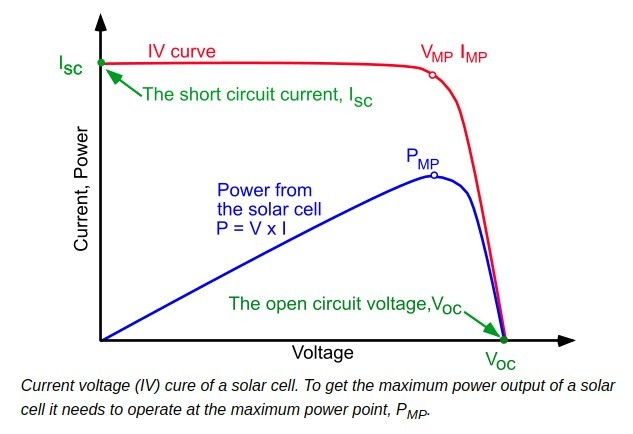
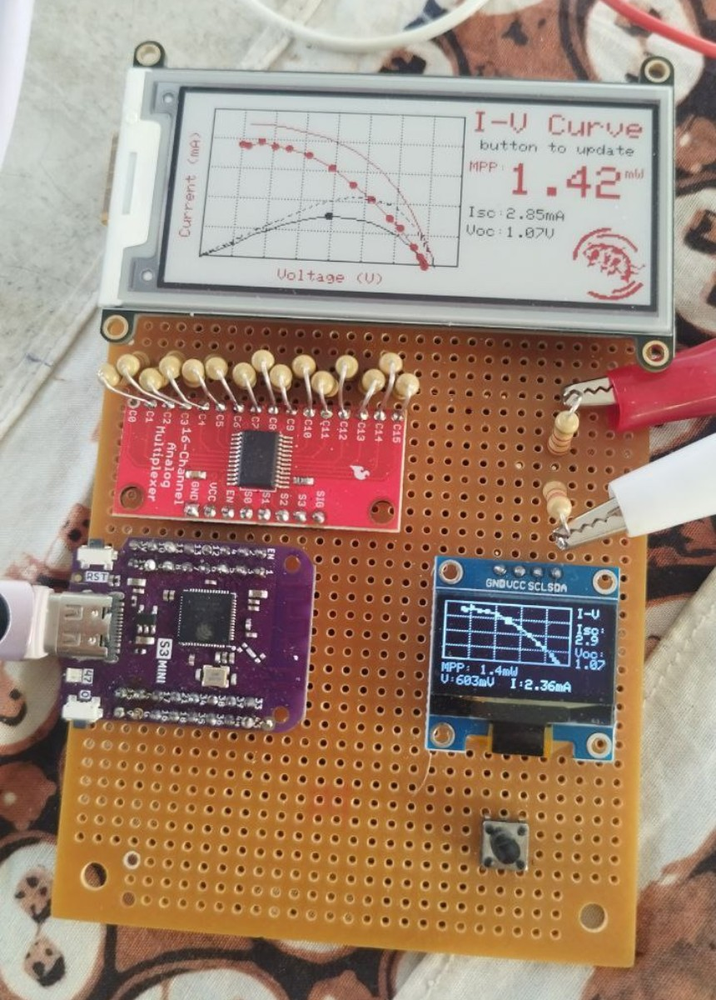
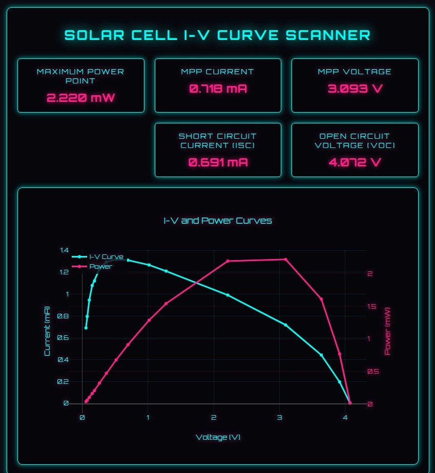
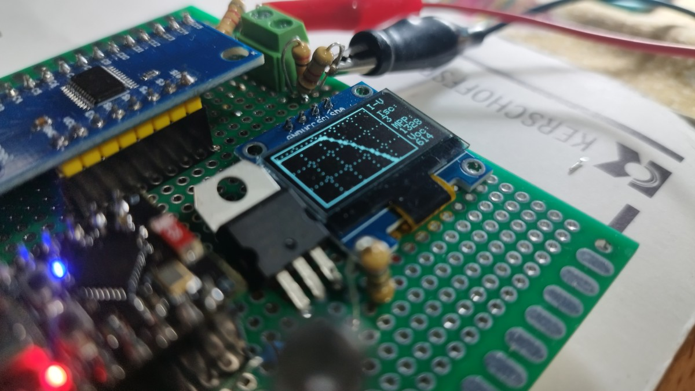
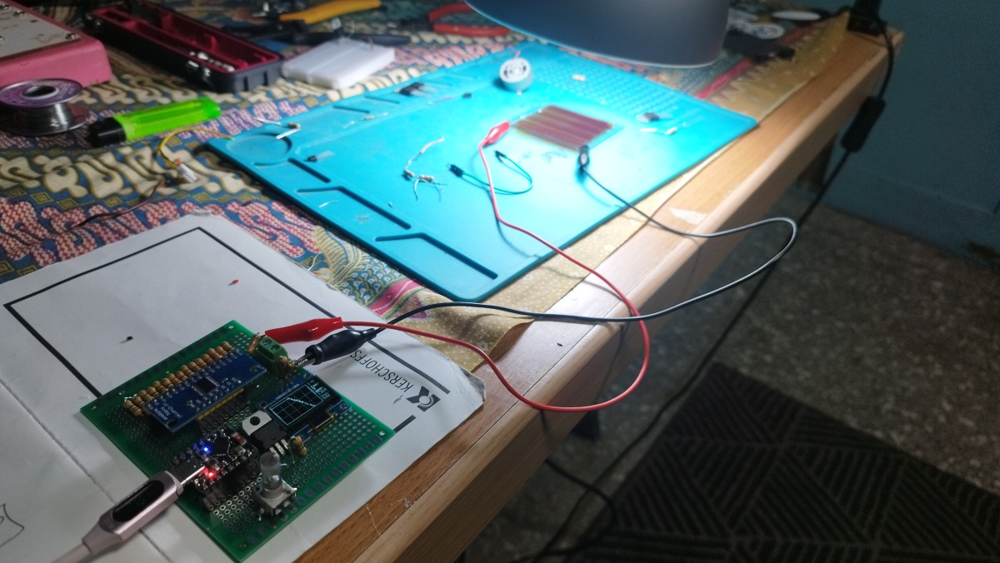

# I-V Curve Analyzer

A versatile measurement tool for characterizing low-power energy sources, with a focus on Dye-Sensitized Solar Cells (DSSC) and other experimental photovoltaic devices. This open hardware project uses an ESP32-S3 Mini to provide accurate I-V curve measurements and real-time Maximum Power Point tracking.

Originally developed for DIYbio and Hackteria workshops, this analyzer is perfect for:

- Testing Dye-Sensitized Solar Cells (DSSC) with natural dyes
- Characterizing small commercial solar cells
- Evaluating thermoelectric generators (TEGs)
- Educational demonstrations of photovoltaic principles
- Rapid prototyping of new energy harvesting devices

The logarithmic resistor array and optional MOSFET configuration allow measurements across a wide range of power outputs, from µW to mW scale, making it ideal for testing experimental and low-power energy sources.

## Features

- Real-time I-V curve measurement
- Maximum Power Point (MPP) tracking
- OLED display with live readings
- E-ink display for persistent measurements
- Logarithmic resistor array for wide measurement range
- Optional MOSFET for low-resistance measurements
- Built-in voltage divider for measuring higher voltage sources (>3.3V)

## Button Control
The device features a single button for measurement control:

- OLED display: continously provides real-time measurement data
- Single press: Initiates a new I-V curve measurement to be displayed on the E-ink display and sent to the serial.

## Example I-V Curve


The analyzer measures both the I-V characteristics (blue curve) and power output (red curve) by sweeping through different load resistances. The Maximum Power Point (MPP) represents the optimal operating point where the product of voltage and current yields the highest power output.

## E-Ink Display Interface
The analyzer features a 2.9" tri-color (black, white, and red) e-ink display (Adafruit IL0373) for persistent measurement visualization. The e-ink display offers:

- High contrast, daylight-readable display
- Persistent display of measurements even when powered off
- 296x128 pixel resolution
- Low power consumption
- E-ink display: Shows the I-V curve with key measurements (Voc, Isc, MPP) 
- The previous measurement is displayed too in lower contrast to compare

The e-ink display provides a persistent view of your latest results that remains visible even when the device is powered off.


*The e-ink display shows the current measurement in dark contrast while the previous measurement is shown in lighter contrast for easy comparison.*

## Web Interface


The web interface provides real-time visualization of measurements, displaying both the I-V curve (blue) and power curve (pink). Key measurements like Maximum Power Point (MPP), Short Circuit Current (Isc), and Open Circuit Voltage (Voc) are shown in an easy-to-read card layout.

## Hardware Overview
```ascii
+-------------+     +----------+     +-----------+
|  Solar      |     | Resistor |     |    MUX    |
|  Cell       |---->|  Array   |---->|  CD74HC   |
| (DUT)       |     | (R1-R16) |     |   4067    |
+-------------+     +----------+     +-----------+
       |                                  |
       |                                  |
       |                                  |
       |           +---------+            |
       +---------->| MOSFET  |            v
       |           | Circuit |           GND
       |           +---------+            
       |                |                 
       |                |                 
       |                |                 
       |                |        +--------------+
       +----------------+------->|  ESP32-S3    |
                                 |    Mini      |
                                 |   (ADC1)     |
                                 +--------------+
                                      ^
                                      |
                                      |
                                +---------------+
                                | UI Controls   |
                                | OLED, Pots,   |
                                | Button,E-ink  |
                                +---------------+
```

## Key Components

- ESP32-S3 Mini
- CD74HC4067 16-channel multiplexer
- SSD1306 OLED display
- 16 precision resistors (83Ω - 10.3kΩ)
- MOSFET for low-resistance measurements

## Technical Notes
### Resistance Measurement Accuracy
The CD74HC4067 multiplexer has a significant internal ON resistance (RON) of approximately 70Ω that affects measurements. Rather than compensating for this in software, we've directly measured each resistor through the MUX circuit. The resistor values listed in the code (83Ω - 10.3kΩ) already include this MUX internal resistance, ensuring accurate current calculations without additional compensation.

For example:
 
- A 13Ω resistor + ~70Ω MUX RON = 83Ω actual measured value
- This combined resistance is what's stored in the code
- No additional software compensation needed
- Measurements remain accurate across the full range

## Getting Started
1. Clone this repository
2. Install PlatformIO
3. Connect hardware according to [hardware/HARDWARE.md](hardware/HARDWARE.md)
4. Build and upload using PlatformIO

## License
MIT License - See [LICENSE](LICENSE) file

## More Information
See [hardware/HARDWARE.md](hardware/HARDWARE.md) for detailed wiring and setup instructions.

## PCB Design and Prototypes
The project includes a custom PCB design for more reliable and compact implementation. Design files and documentation can be found in:
 
- Hardware documentation: [`hardware/HARDWARE.md`](hardware/HARDWARE.md)
- PCB design files: [`hardware/I-V-CurvePCB/`](hardware/I-V-CurvePCB/)
- PCB renders: [`images/pcb/`](images/pcb/)
- Prototype photos: [`images/prototype/`](images/prototype/)


*Close-up view of the analyzer displaying real-time measurements on the OLED screen. The device shows voltage, current, and power readings while performing I-V curve analysis.*


*First prototype of the I-V Curve Analyzer testing a series of Dye-Sensitized Solar Cells (DSSC). The compact design allows for easy in-line measurements during workshops and experiments.*

## Credits
Code and hardware design by Marc Dusseiller (@dusjagr), with assistance from the Windsurf AI coding assistant. This collaboration demonstrates how AI tools can enhance open hardware development while maintaining human creativity and expertise at the core of the project.

## References
- I-V curve image from [PVEducation.org](https://www.pveducation.org/pvcdrom/solar-cell-operation/iv-curve)

## Future Improvements
Future development plans for the I-V Curve Analyzer include:

1. **Enhanced Multiplexer**: Replace the current multiplexer with ADG706 for lower internal resistance, improving measurement accuracy especially in the low-resistance range.

2. **IoT Integration**: Utilize the ESP32's WiFi capabilities to upload measurements to an IoT cloud service for:
   - Remote monitoring and data logging
   - Long-term performance analysis
   - Data sharing and collaboration

3. **On-Board Storage**: Implement measurement storage and numbering on the chip for:
   - Offline data collection
   - Sequential measurement tracking
   - Later retrieval and analysis

These improvements will enhance the device's functionality, usability, and data management capabilities while maintaining its core purpose as an accessible tool for energy harvesting research and education.
